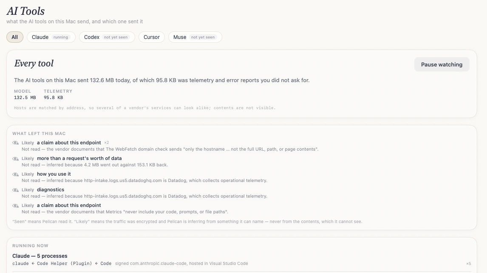
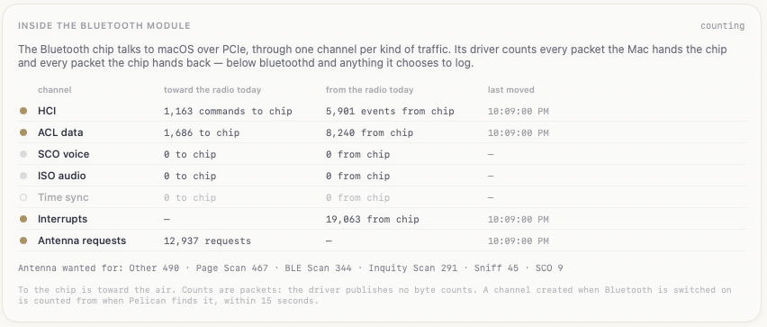
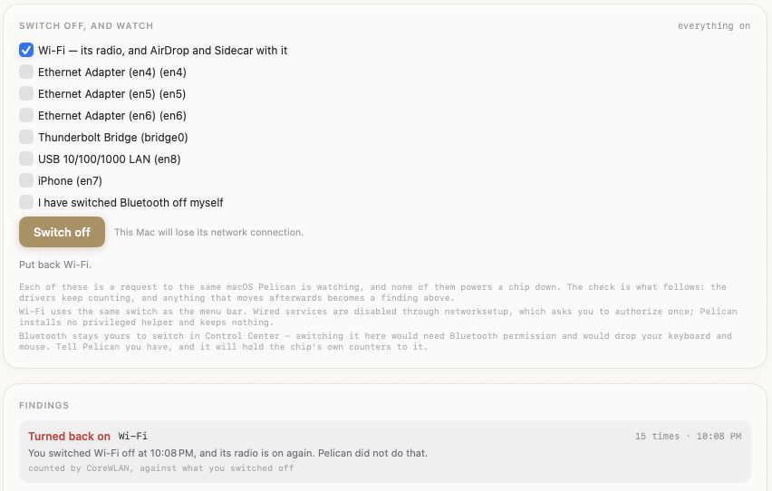

# Pelican

**An independent, open-source check on what Rao's apps send over the network.**

Rao's apps listen all day. [Ambient](https://ambient.rao.nyc) reads along with you and listens
for "Hey Mary", and in on-device mode it promises that nothing leaves your Mac except its
one-time model download. Pelican checks that promise: it watches every connection Ambient's
processes make, judges each one against the consent you gave, and keeps the record on your Mac.

Pelican watches; it never alters or blocks traffic, and it carries no secrets. The one thing it
changes is on the Radios screen, and only when you ask: it can switch Wi-Fi and the wired
services off, and then keep checking that they stayed off. Everything it concludes comes from
what macOS reports, and you can verify all of it by reading this repository.


## What it checks

- **Trust level.** *Within your consent*, *Worth a look* or *Outside your consent*, shown in the
  window, a menubar shield, the Dock badge, and a notification when it gets worse.
- **Consent.** Read from Ambient's own saved settings, read-only. Each connection is judged by
  the mode in force when it opened, and every change of mode is logged. You can override the
  mode.
- **Every connection.** Sorted into one of three classes:

  | Class | Meaning |
  |---|---|
  | *On this Mac* | Ambient talking to its own local servers on 127.0.0.1 |
  | *Expected* | a host Ambient is known to use, in a mode that allows it |
  | *Outside your consent* | anything else: an unknown host, a hosted service while on-device, data sent to a download host, a server listening on the network |

- **Identity.** Each process's code signature must validate, carry Ambient's identifiers, and
  come from the same developer as the rest. A notarized copy in `/Applications` is the reference
  every running copy must match, and a process merely *named* Ambient is flagged. Pelican shows
  the certificate and team macOS reports so you can compare them with the site.
- **The record.** Each day's connections, runs, consent changes and findings are kept for 30
  days in `~/Library/Application Support/Pelican/ledger/`. *Export report…* writes Markdown with
  the same data as JSON beside it.

Craft and Veil are listed as *coming soon* and will get the same checks when they ship.

## What Pelican knows about Ambient

Only product facts, all in [RaoApp.swift](Sources/Rao/RaoApp.swift): bundle and helper
identifiers, loopback ports, the hosts Ambient contacts in each mode, and where it keeps its
settings. No team ID, certificate name or signing material of Rao's or Pelican's own appears
in this repository, its scripts or its build. (The AI Tools catalog does name other vendors'
team IDs: they are what macOS reports for those vendors' apps, and showing them is how you
check a process is really theirs.)

## How it watches, and what it can miss

Pelican uses no kernel extension, no network extension, no injection and no root. It combines
two sources:

- **Live socket events** from macOS's NetworkStatistics framework, which report each kernel
  socket as it opens and closes. This covers Ambient's local traffic.
- **`nettop` polling**, every second while Ambient (or an AI tool that may use URLSession) runs,
  every 2 seconds while only AI tools that use kernel sockets run, and every 5 seconds otherwise.
  This covers URLSession and Network.framework connections, which is how Ambient reaches the
  internet.

Two limits, which Pelican reports rather than hides:

- A URLSession connection that opens and closes within a single second could be missed. Every
  report says so.
- Time Ambient ran while Pelican wasn't watching is counted, shown, and lowers the day's level.

Pelican cannot block or alter a connection. It can switch a whole interface off, if you ask it
to on the Radios screen. Its own network use is DNS lookups (including the AI tools
catalog's hostnames, so their addresses can be recognised) and, only if you load the analyst
model, a HuggingFace download.

## Install

Apple silicon, macOS 15 or later. Download `Pelican-<version>.pkg` and its `.sha256`, then:

```bash
shasum -a 256 -c Pelican-<version>.pkg.sha256
pkgutil --check-signature Pelican-<version>.pkg
open Pelican-<version>.pkg
```

Turn on **Start at login** from the menubar shield so the record covers the whole day. Closing
the window keeps Pelican watching; quit from the shield.

To uninstall, quit Pelican and move it to the Trash. Optionally remove its data with
`rm -rf ~/Library/Application\ Support/Pelican` and `sudo pkgutil --forget nyc.rao.pelican.pkg`.

## Build it yourself

```bash
git clone https://github.com/rao-studios/Frigate.git
export FRIGATE_DIR="$PWD/Frigate"

swift build --build-system native
./scripts/build-metallib.sh
swift run --build-system native Pelican
```

No certificates are needed. [docs/BUILDING.md](docs/BUILDING.md) covers the app bundle, the
signed installer, headless diagnostics and the source layout.

## AI Tools

The **AI Tools** screen shows what the AI tools on this Mac send, and which one sent it. Claude
Code and Cursor are recognised today; Codex and Muse are listed and attribute nothing until
someone confirms their identifiers with `Pelican --ai-probe`.



- **Every connection is sourced to its tool**, with the reason shown: the tool's code
  signature, the app bundle it runs inside, or the process chain that leads back to it — so a
  `curl` that Claude Code runs inside VS Code is Claude Code's, shown as
  `curl ← zsh ← claude`, hosted in Visual Studio Code.
- **Every destination gets a purpose** — the model, sign-in, telemetry, error reports,
  updates, code — from the vendor's own published hosts. Telemetry and error reports are
  counted separately, as traffic you did not ask for.
- **It says what it cannot tell.** Without reading the traffic, an address is all Pelican has,
  and a vendor's services often share one; when they do, the screen says so instead of
  guessing. Contents are not visible.
- **MCP servers** configured in Claude Code, Claude Desktop, Cursor or Codex are named when the
  tool starts them. Those config files are read, never written, and their environment
  variables and headers — where tokens live — are never read into Pelican.

The catalog of tools is in [AIToolCatalog.swift](Sources/AITools/AIToolCatalog.swift). Every
entry says whether it was observed on a real Mac or only taken from the vendor's documentation.

## Leak Guard

Across every screen, Pelican notes what personal information leaves this Mac — and always says
how it knows, because the difference matters:

- **Seen** means Pelican read it, and the finding says where it was read.
- **Likely** means the traffic was encrypted and Pelican is inferring from something it can
  name: the vendor's own documentation for that endpoint, what earlier readable traffic to it
  carried on this Mac, the fact that the destination is a known analytics or crash collector,
  or an upload far larger than its reply.

The two are never added together. Findings are kept for 30 days in
`~/Library/Application Support/Pelican/ledger/guard/`, and a finding never holds the value it
is about — only a masked sample, enough to recognise and not enough to use.

Until inspection exists, almost everything is *Likely*: the only text Pelican can read is
hostnames and the command lines of what an agent runs. The detectors that will read request
contents are written and tested, and switch on when inspection does.

## Radios

The **Radios** screen shows what reached this Mac's radio chips today, counted on the chips' own
transports.

**Inside the Bluetooth module.** The Bluetooth chip talks to macOS over PCIe, through one channel
per kind of traffic: HCI (commands to the chip, events from it), ACL (data for connected
devices), SCO (call audio) and ISO (LE Audio). The chip's driver counts every packet the Mac
hands it and every packet it hands back. Pelican reads those counters every second, along with
the chip's interrupts and its requests for the antenna it shares with Wi-Fi (counted by the
Wi-Fi driver, with the cause: *BLE Scan*, *Page Scan* and so on). The counters are read through
IOReport, the same interface `powermetrics` uses, with no root, no permission prompt and no
extra hardware. They sit below bluetoothd, so they count traffic whether or not anything logs
it. Since the drivers never stop counting, what moved while the Mac slept or watching was paused
is counted too, though not when it moved.



**Inside the Wi-Fi chip.** The same, for Wi-Fi: doorbells rung to the chip, its interrupts, and
the radio's own time spent transmitting and receiving.

**Who asked.** bluetoothd's own log (`log stream`, which needs an administrator account) names
the processes that asked for scans and other requests, by name and pid.

Pelican also reads Wi-Fi power from CoreWLAN and Lockdown Mode from its preference. When **Wi-Fi
is off and Lockdown Mode is on**, every channel that carried packets into the Bluetooth chip is
itemised. It is a contradiction if the Wi-Fi radio counts transmit time, or a Wi-Fi interface
counts packets, while Wi-Fi is reported off.

It never asks for Bluetooth permission and never talks to bluetoothd. Log lines carry device
names and addresses, so none is kept: only process names, counts, and the format of lines it
could not read.

The limit, stated on the screen: these are the Mac's own drivers counting. Anything the radio
chip's firmware does on its own, without the Mac handing it a packet, does not pass through
these channels. BLE advertising is the main case. One HCI command starts it, and that command is
counted; the chip then advertises by itself until told to stop. While Wi-Fi is on, its antenna
requests may still show the advertising. Counts are packets, not bytes, because the drivers
publish no byte counts.

### Switch off, and watch

The screen's one control, and the only place Pelican changes anything. You pick what to switch
off and Pelican asks macOS to do it:

- **Wi-Fi**, through CoreWLAN — the same switch as the menu bar's. AirDrop and Sidecar go with it.
- **Wired services** (Thunderbolt Bridge, USB adapters, a tethered iPhone), through
  `networksetup`. These live in a root-owned file, so macOS asks you to authorize once. Pelican
  installs no privileged helper and keeps nothing afterwards.
- **Bluetooth stays yours**, in Control Center. Switching it here would mean asking for Bluetooth
  permission and would drop your keyboard and mouse. Tell Pelican you have switched it off and it
  will hold the chip's own counters to that.



The switching is the unremarkable part: these are requests to the same macOS you are checking on,
and none of them powers a chip down. What the control is for is the line underneath. Pelican goes
on reading the counters, and anything afterwards becomes a finding:

- an interface counting packets after you switched its service off;
- the Wi-Fi radio counting transmit time while reported off;
- data entering the Bluetooth chip after you said you had switched Bluetooth off;
- **anything switched back on** — Pelican names it, because Pelican did not do it.

Until something does, it says *stayed off*, with how long it has been checking. "Put back" enables
only the services Pelican disabled, so one that was already off stays off. What you switched off
stays off across midnight, and so does the check.

`Pelican --radio-probe 30` prints the readings, a line a second. The day's record is kept for 30
days in `~/Library/Application Support/Pelican/ledger/radio/`.

## Also in Pelican

Beyond the Rao, AI Tools and Radios screens, Pelican is a general network monitor: **Connections** and **Processes**
show every process's live flows with what Leak Guard has noted about each, and **Analysis** has
an on-device Mistral model review them for beaconing, exfiltration-sized transfers, unexpected
talkers and privacy exposure. All analysis is local.

## License

GNU GPL v3. See [LICENSE](LICENSE).
