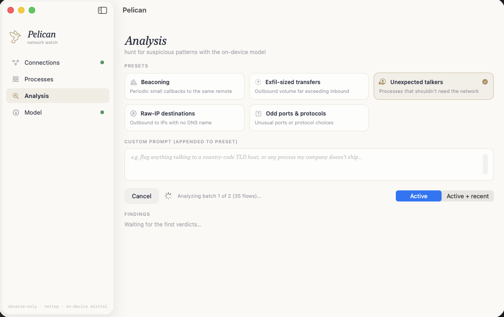

# Pelican



A **Little Snitch-style, observe-only network monitor** for macOS with on-device
LLM analysis. Pelican watches every process's incoming and outgoing connections
and lets an on-device Mistral model hunt for suspicious patterns — with preset
threat-hunting prompts or your own custom prompt. All analysis is local; no flow
data ever leaves the machine.

## How it works

- **Capture** — polls `nettop -x -L 1 -t external` (userspace, unprivileged) on
  an interval, diffs the per-process flow table between ticks, and tracks
  opened/closed flows, byte deltas, direction, and reverse-DNS names. No kernel
  extension, no NetworkExtension, no injection — which also means observe-only:
  Pelican reports flows but cannot block them. (A NetworkExtension content
  filter backend could be added later behind the same flow model; that requires
  a signed .app bundle and Apple entitlements.)
- **Analysis** — serializes batches of flows into a compact table and asks a
  Mistral MLX model (running in-process via the Frigate package, like
  Fleet/Client) for JSON verdicts: `suspicious`/`ok`, a 0–10 score, and a short
  reason. Verdict badges flow back into the Connections and Processes views.
- **Presets** — beaconing, exfil-sized transfers, unexpected talkers, raw-IP
  destinations, odd ports & protocols — plus a free-form custom prompt box.

## Run

```bash
swift build
./build-metallib.sh          # compile MLX Metal shaders next to the binary (once per build)
swift run Pelican
```

Then: **Connections → Start monitor** to watch the wire; **Model → Download &
load** to fetch the default `mlx-community/Mistral-7B-Instruct-v0.3-4bit`
(~4.1 GB, cached in `~/Library/Caches/models`); **Analysis → pick a preset →
Run analysis**.

> **Metal note:** MLX loads `mlx.metallib` from next to the running binary.
> Run `./build-metallib.sh` after `swift build` or inference fails with
> *"Failed to load the default metallib"*. The Model tab shows a banner with
> the fix command if the metallib is missing.
>
> **Building from Xcode:** Xcode builds to
> `~/Library/Developer/Xcode/DerivedData/Pelican-*/Build/Products/Debug/`,
> which starts without a metallib. `./build-metallib.sh` also copies the
> metallib into any existing Pelican DerivedData products dir — run it once
> after your first Xcode build, and again after **Clean Build Folder** (which
> wipes the products dir). Release scheme: `./build-metallib.sh release`.

## Design

Follows Fleet/Client's warm design language (cream `#FAF9F6`, ink `#2D3142`,
gold `#AE9060`, light-italic-serif headings) with a gold **bird mark** and the
orbiting-ring motion on empty states.

## Layout

```
Sources/
  Core/     Design tokens, AppState, flow models, nettop parser,
            NetworkMonitor (actor), DNSResolver, LLMSession (MLX),
            ModelStore, AnalysisEngine, Presets
  Views/    ContentView (sidebar shell), Components,
            Connections / Processes / Analysis / Model screens
```
