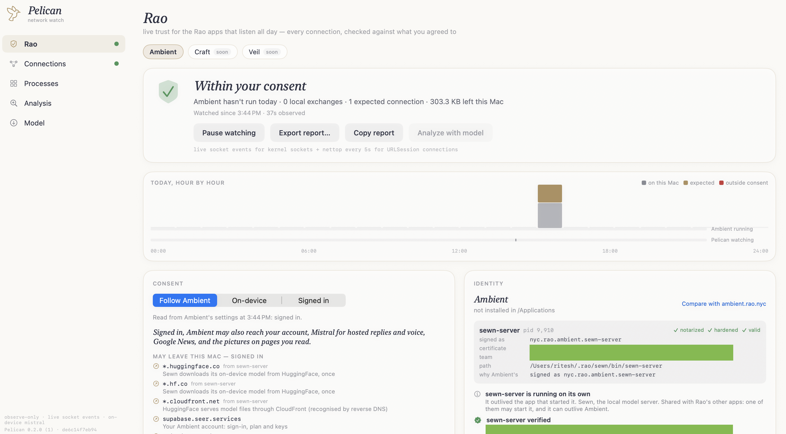

# Pelican

**An independent, open-source check on what Rao's apps send over the network.**

Rao's apps listen all day. [Ambient](https://ambient.rao.nyc) reads along with you and listens
for "Hey Mary", and in on-device mode it promises that nothing leaves your Mac except its
one-time model download. Pelican checks that promise: it watches every connection Ambient's
processes make, judges each one against the consent you gave, and keeps the record on your Mac.

Pelican only observes, and it carries no secrets. Everything it concludes comes from what macOS
reports, and you can verify all of it by reading this repository.



## What it checks

- **Trust level.** *Within your consent*, *Worth a look* or *Outside your consent*, shown in the
  window, a menubar shield, the Dock badge, and a notification when it gets worse.
- **Consent.** Read from Ambient's own saved settings, read-only. Each connection is judged by
  the mode in force when it opened, and every change of mode is logged. You can override the
  mode.
- **Every connection.** Sorted into one of three classes:

  | Class | Meaning |
  |---|---|
  | *On this Mac* | Ambient talking to its own local servers on 127.0.0.1 |
  | *Expected* | a host Ambient is known to use, in a mode that allows it |
  | *Outside your consent* | anything else: an unknown host, a hosted service while on-device, data sent to a download host, a server listening on the network |

- **Identity.** Each process's code signature must validate, carry Ambient's identifiers, and
  come from the same developer as the rest. A notarized copy in `/Applications` is the reference
  every running copy must match, and a process merely *named* Ambient is flagged. Pelican shows
  the certificate and team macOS reports so you can compare them with the site.
- **The record.** Each day's connections, runs, consent changes and findings are kept for 30
  days in `~/Library/Application Support/Pelican/ledger/`. *Export report…* writes Markdown with
  the same data as JSON beside it.

Craft and Veil are listed as *coming soon* and will get the same checks when they ship.

## What Pelican knows about Ambient

Only product facts, all in [RaoApp.swift](Sources/Core/Rao/RaoApp.swift): bundle and helper
identifiers, loopback ports, the hosts Ambient contacts in each mode, and where it keeps its
settings. No team ID, certificate name or signing material appears in this repository, its
scripts or its build.

## How it watches, and what it can miss

Pelican uses no kernel extension, no network extension, no injection and no root. It combines
two sources:

- **Live socket events** from macOS's NetworkStatistics framework, which report each kernel
  socket as it opens and closes. This covers Ambient's local traffic.
- **`nettop` polling**, every second while Ambient runs and every 5 seconds otherwise. This
  covers URLSession and Network.framework connections, which is how Ambient reaches the internet.

Two limits, which Pelican reports rather than hides:

- A URLSession connection that opens and closes within a single second could be missed. Every
  report says so.
- Time Ambient ran while Pelican wasn't watching is counted, shown, and lowers the day's level.

Pelican cannot block anything. Its own network use is DNS lookups and, only if you load the
analyst model, a HuggingFace download.

## Install

Apple silicon, macOS 15 or later. Download `Pelican-<version>.pkg` and its `.sha256`, then:

```bash
shasum -a 256 -c Pelican-<version>.pkg.sha256
pkgutil --check-signature Pelican-<version>.pkg
open Pelican-<version>.pkg
```

Turn on **Start at login** from the menubar shield so the record covers the whole day. Closing
the window keeps Pelican watching; quit from the shield.

To uninstall, quit Pelican and move it to the Trash. Optionally remove its data with
`rm -rf ~/Library/Application\ Support/Pelican` and `sudo pkgutil --forget nyc.rao.pelican.pkg`.

## Build it yourself

```bash
git clone https://github.com/rao-studios/Frigate.git
export FRIGATE_DIR="$PWD/Frigate"

swift build --build-system native
./scripts/build-metallib.sh
swift run --build-system native Pelican
```

No certificates are needed. [docs/BUILDING.md](docs/BUILDING.md) covers the app bundle, the
signed installer, headless diagnostics and the source layout.

## Also in Pelican

Beyond the Rao screen, Pelican is a general network monitor: **Connections** and **Processes**
show every process's live flows, and **Analysis** has an on-device Mistral model review them for
beaconing, exfiltration-sized transfers and unexpected talkers. All analysis is local.

## License

GNU GPL v3. See [LICENSE](LICENSE).
